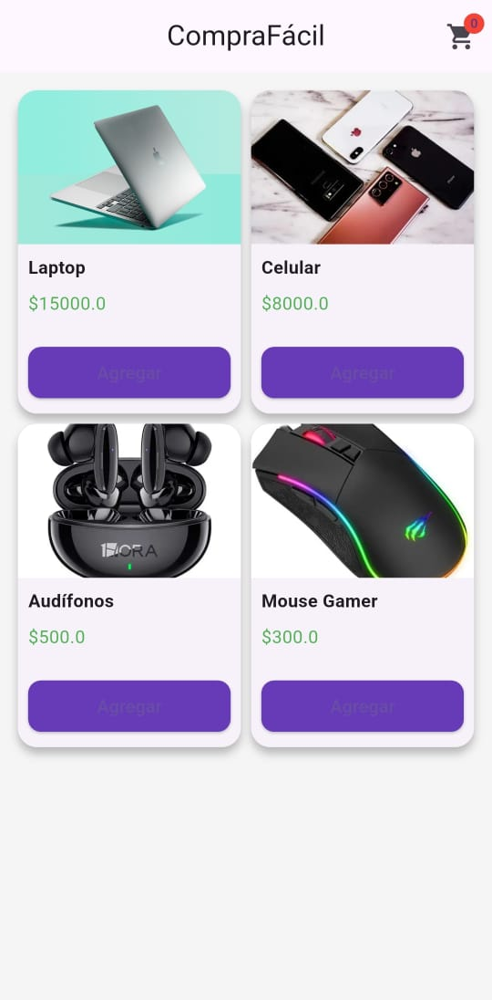
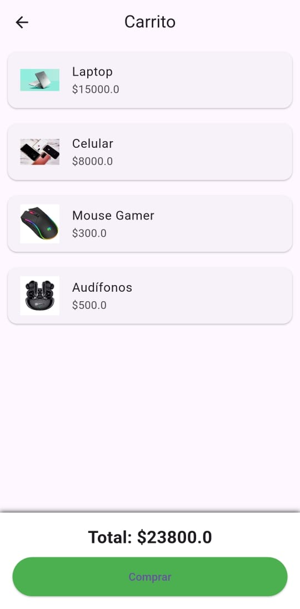

# 🛒 CompraFacil

CompraFacil es una aplicación móvil desarrollada en Flutter que simula una tienda en línea, permitiendo a los usuarios explorar productos, filtrarlos y gestionar un carrito de compras de forma sencilla e intuitiva.

---

## 🚀 Estado del proyecto

🟢 En desarrollo

---

## 📱 Características

* 🔐 Inicio de sesión (login)
* 🛍️ Catálogo de productos
* 🛒 Carrito de compras
* 🔎 Filtros de búsqueda estilo Amazon
* 💾 Persistencia de datos (SharedPreferences)
* 🎨 Interfaz moderna y amigable

---

## 🛠️ Tecnologías utilizadas

* Flutter
* Dart
* Provider (gestión de estado)
* SharedPreferences

---

## 📸 Capturas de pantalla

---

## 📦 Instalación

1. Clona este repositorio:

bash
git clone https://github.com/karlaitzamaraolguinf-del/CompraFacil.git

2. Entra al proyecto:

bash
cd CompraFacil

3. Instala dependencias:

bash
flutter pub get

4. Ejecuta la app:

bash
flutter run

---

## 📂 Estructura del proyecto

lib/
 ├── models/
 ├── screens/
 ├── services/
 ├── widgets/

---

## 👩‍💻 Autor

* Karla Itzamara Olguin

---

## 📄 Licencia

Este proyecto es de uso educativo.
